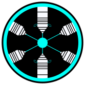

# Unnamed Power Core: Isky Parody

## Public Archive: Saihex Studios completed this project, but it was sadly abandoned on February 11, 2025, due to a lack of interest. Contents still fall under CC-BY-NC-SA unless otherwise noted however you may use the game as the base and remove all of Saihex contents (e.g. Iskyverse old logo, Saihex logo, etc.). If you have any more concerns about what is considered Saihex content or not feel free to contact our staff at our Discord server.

### All Saihex's protected media are however removed. (e.g. Sairo FBX model.)

**Unnamed Power Core: Isky Parody** is a parody by [IskandarAlex2](https://github.com/IskandarAlex2) of [Unnamed Power Core](https://www.roblox.com/games/746120281) by [Tecc.src](https://twitter.com/SourceAvailable) on Roblox. This parody falls under [Iskyverse](https://github.com/IskandarAlex2/IskandarAlex2/blob/master/Iskyverse.md) as its own subuniverse.

This parody refine the game and make it more to a maintaining the reactor rather than "wait 20 minutes for something to explode" simulator.

Made with [Unreal Engine 5.4](https://www.unrealengine.com). This game do not prioritize graphic photorealism and more to scientific accuracy mix with some additional science fiction aspects. After all, the game revolves around a floating plasma ball reactor.

Other than being a game, this project also meant to help beginners to start with their Unreal Engine game development as a learning material.

## Licenses
This is a open source project meant not only to be played but also used as education resources for those who are starting with game development specifically using [Unreal Engine 5.4](https://www.unrealengine.com).

There are two separate licenses within this project which are shown below.

### Code License (MIT)

The code in this repository is licensed under the MIT License. You can use, modify, and distribute it freely, as long as the original license notice is included in your copies or substantial portions of the Software.

This licenses applies to configuration files, Unreal Engine Blueprint, Unreal Engine Material Code, etc.

See the [LICENSE](LICENSE) file for more details.

### Creative Content License (CC-BY-NC-SA)

The creative content in this repository, including images, audio, video, maps, and 3D models, is licensed under the Creative Commons Attribution-NonCommercial-ShareAlike 4.0 International License (CC BY-NC-SA 4.0) unless otherwise noted. This means you can share and adapt the material for non-commercial purposes, as long as you give appropriate credit, provide a link to the license, and indicate if changes were made. If you remix, transform, or build upon the material, you must distribute your contributions under the same license as the original.

See the [LICENSE-CC-BY-NC-SA](LICENSE-CC-BY-NC-SA) file for more details.
